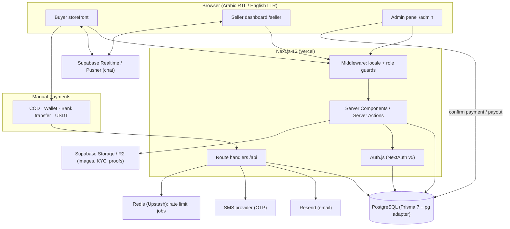

# ARCHITECTURE — Hezalli System Architecture

> Output of **Phase 1, Step 1.2**. Consistent with `DECISIONS.md`. Read this to
> understand the big picture before building. Update it whenever a decision or
> a structural choice changes.

_Last updated: 2026-07-14._

---

## 1. Final technology stack

Starting from the master plan's recommendation, adjusted for the Yemen
decisions (manual payments, multi-currency, Arabic/RTL).

| Layer | Choice | Notes / why |
|---|---|---|
| Framework | **Next.js 15** (App Router, React 19, TypeScript) | One codebase for site + API route handlers |
| Styling | **Tailwind CSS v4 + shadcn/ui** | Already scaffolded in Phase 2.1 |
| i18n / RTL | **next-intl** | Arabic (default, RTL) + English (LTR). Set up in Phase 2.3 |
| Database | **PostgreSQL** (Neon or Supabase, free tier) | Provider-agnostic connection string |
| ORM | **Prisma 7** | New `prisma-client` generator + **`pg` driver adapter** (see §5). URL in `prisma.config.ts` for the CLI, `lib/prisma.ts` for runtime |
| Auth | **Auth.js (NextAuth v5)** | Email/password + **phone OTP** (important for COD trust); Google optional |
| File storage | **Supabase Storage** (or Cloudflare R2) — S3-compatible | Product images, KYC docs, payment proofs |
| Payments | **Manual** (COD, local wallets, bank transfer, **USDT**) with admin confirmation | No automated card gateway at launch. `Payment` model is gateway-ready |
| Exchange rates | Admin-managed table + optional rate-feed job | USD base → YER / SAR / AED display |
| Email | **Resend** | Verification & order emails |
| SMS / OTP | Pluggable SMS provider (env-configured) | Phone verification for accounts & COD |
| Realtime chat | **Supabase Realtime** (or Pusher) | Buyer↔seller chat, Phase 12 |
| Cache / jobs | **Redis (Upstash)** — added when needed | Rate limits, OTP throttling, auto-complete jobs |
| Hosting | **Vercel** (app) + Neon/Supabase (DB/storage) | Domain: **www.hezalli.com** |

## 2. One app, three surfaces + API

The single Next.js app serves three audiences plus an API, separated by route
groups and guarded by role:

- **Buyer site** — public storefront (`/`, categories, product pages, cart,
  checkout, buyer account & orders).
- **Seller dashboard** — `/seller/*` — store, products, orders, shipments,
  returns, chat, promotions, payouts, settings. Requires the **SELLER** role.
- **Admin panel** — `/admin/*` — users, sellers, products, orders, disputes,
  categories, promotions, payments/payouts confirmation, exchange rates, CMS,
  settings. Requires the **ADMIN** role.
- **API** — Next.js **route handlers** under `app/api/*` for anything the
  server components / server actions don't cover (webhooks, uploads, OTP, etc.).

### Proposed folder structure

```
app/
  [locale]/                 # next-intl locale segment (ar | en), RTL/LTR
    (shop)/                 # buyer storefront route group
      page.tsx              # home
      c/[...slug]/          # category pages
      p/[slug]/             # product detail
      cart/  checkout/  account/  orders/
    seller/                 # SELLER dashboard (guarded)
      dashboard/ products/ orders/ shipments/ returns/
      chat/ promotions/ payouts/ settings/
    admin/                  # ADMIN panel (guarded)
      dashboard/ users/ sellers/ products/ orders/ disputes/
      categories/ promotions/ payments/ payouts/ rates/ pages/ settings/
  api/                      # route handlers (uploads, otp, webhooks, cron)
  layout.tsx  globals.css
components/                 # shared UI (shadcn/ui in components/ui)
lib/
  prisma.ts                 # Prisma 7 client singleton (pg adapter)
  generated/prisma/         # generated client (git-ignored)
  auth.ts  money.ts  i18n.ts  storage.ts  ...
messages/                   # next-intl translations: ar.json, en.json
prisma/
  schema.prisma  seed.ts  migrations/
docs/                       # the build plan + these design docs
```

## 3. Auth & roles

- **One `User` account** carries a set of **roles**: `BUYER`, `SELLER`,
  `ADMIN`. Every user is a buyer by default; becoming a seller adds the SELLER
  role and creates a `SellerProfile` + `Store` (automatic approval — can sell
  immediately). ADMIN is granted manually.
- **Auth.js (NextAuth v5)** with a Prisma adapter; sessions via secure cookies.
- **Verification:** email (Resend) and **phone OTP** (SMS provider). Phone
  verification matters for COD trust and to limit COD abuse.
- **Route protection:** middleware + server-side role checks guard `/seller/*`
  and `/admin/*`; server actions re-check the role (never trust the client).

## 4. Money flow (escrow, USD base, commission, payout)

Everything of record is in **USD**; display/collection currency is snapshotted
per order (see `DATABASE.md`).

**Prepaid order (wallet / bank transfer / USDT):**

```
Buyer pays (YER/SAR/AED/USDT)  ──►  amount recorded in USD at snapshot rate
        │                            Payment: PENDING → (admin confirms) → CONFIRMED
        ▼
Platform HOLDS the funds (escrow)    Order: CONFIRMED → SHIPPED → DELIVERED
        │
        ▼
Buyer clicks "Order received"  (or auto-complete after N days)  → Order COMPLETED
        │
        ▼
Seller ledger:  + order total (USD)  − 10% commission  = net credited to balance
        │
        ▼
Seller requests payout → admin pays out (bank/wallet/USDT) → ledger debited
Return/dispute BEFORE completion → refund buyer from held funds; seller not credited
```

**COD order:** the seller/courier collects cash on delivery, so there is no
held money. On completion the platform's **10% commission is debited from the
seller's balance** (an amount the seller owes the platform). Balances can go
negative until settled against future prepaid earnings or a direct payment.

**Manual confirmation:** wallet/bank/USDT payments carry a proof (uploaded
image or USDT tx hash) that an admin verifies to move `Payment` to `CONFIRMED`.

## 5. Data access (Prisma 7 specifics)

- Generator: `prisma-client` → output `lib/generated/prisma` (git-ignored;
  regenerated by a `postinstall` hook).
- **Runtime:** `lib/prisma.ts` builds a `PrismaClient` with the **`@prisma/adapter-pg`** driver adapter, reading `DATABASE_URL` from the environment.
- **CLI (migrate / db push / studio):** reads the URL from `prisma.config.ts`
  (which loads `.env` via `dotenv`).
- This split is a Prisma 7 requirement — `url` is no longer allowed in
  `schema.prisma`.

## 6. Storage & email

- **Images / files** (product photos, KYC documents, payment proofs) go to
  **Supabase Storage** (or Cloudflare R2) via signed uploads; only URLs/keys are
  stored in Postgres. Buckets are access-scoped (public product images;
  private KYC & payment proofs).
- **Email** via **Resend** (verification, order status, payout notices).
- **SMS/OTP** via a pluggable provider (env-configured) for phone verification.

## 7. Components diagram



## 8. Environment variables (`.env.example` — names only)

Added incrementally by phase; `.env` is git-ignored, `.env.example` documents
names only (no secrets).

```
# Core (Phase 2)
DATABASE_URL=
NEXT_PUBLIC_APP_URL=

# Auth (Phase 3)
AUTH_SECRET=
AUTH_URL=
AUTH_GOOGLE_ID=
AUTH_GOOGLE_SECRET=

# Phone OTP / SMS (Phase 3)
SMS_PROVIDER=
SMS_API_KEY=
SMS_SENDER_ID=

# Email (Phase 3)
RESEND_API_KEY=
EMAIL_FROM=

# File storage (Phase 5)
STORAGE_ENDPOINT=
STORAGE_REGION=
STORAGE_BUCKET=
STORAGE_ACCESS_KEY_ID=
STORAGE_SECRET_ACCESS_KEY=

# Payments — manual (Phase 9)
PLATFORM_USDT_ADDRESS_TRC20=
PLATFORM_USDT_ADDRESS_ERC20=
PLATFORM_BANK_DETAILS=
PLATFORM_WALLET_DETAILS=

# Currency (Phase 9)
BASE_CURRENCY=USD
EXCHANGE_RATE_FEED_URL=

# Realtime chat (Phase 12)
REALTIME_APP_ID=
REALTIME_KEY=
REALTIME_SECRET=

# Cache / jobs (added when needed)
REDIS_URL=
```

---

> **🔜 NEXT-STEP CARD**
> - **Next step:** 1.3 — Database design (`DATABASE.md`) — the most important
>   design step of the whole project
> - **Model:** Claude Opus 4.8 (best available)
> - **Thinking level:** High
> - **Session:** Same session
