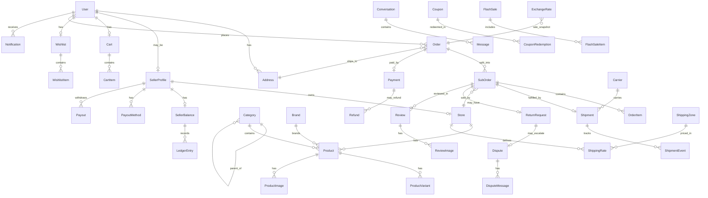
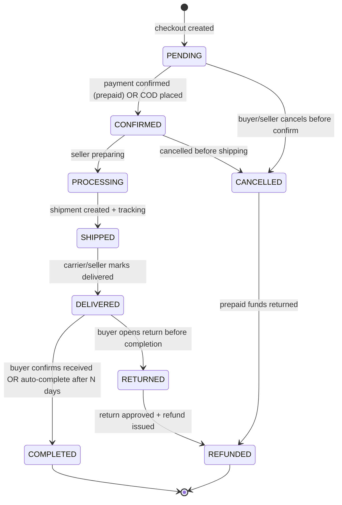
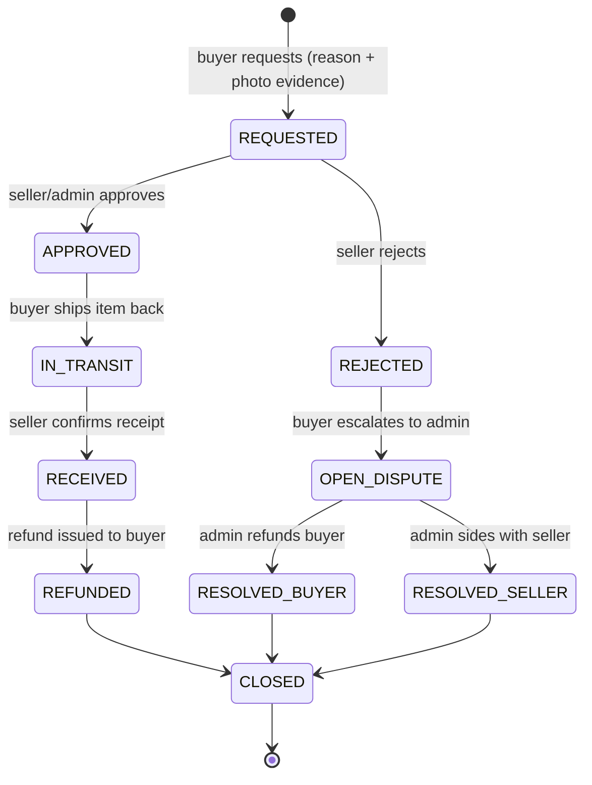

# DATABASE — Hezalli Data Model

> Output of **Phase 1, Step 1.3** — the most important design step. A
> Prisma-style **draft** of every model, its key fields, and relationships,
> plus an ER diagram and the order/return status flows. Consistent with
> `DECISIONS.md` and `ARCHITECTURE.md`.
>
> This is a **design draft**. Step 2.2 translates it into the real, compiling
> `prisma/schema.prisma` (adding every reverse relation, index, and
> `@@map`/`@@unique` detail). Entities for later phases are defined **now** so
> we avoid painful migrations later.

_Last updated: 2026-07-14._

---

## Conventions

- **IDs:** `cuid()` string PKs.
- **Money:** stored in the **USD base currency** as `Decimal @db.Decimal(12, 2)`.
  USDT is treated as USD 1:1. Display amounts (YER/SAR/AED) are derived from
  `ExchangeRate`, and each order **snapshots** its display currency + rate.
- **Timestamps:** every table has `createdAt` / `updatedAt` (omitted below for
  brevity except where meaningful).
- **Soft state** is expressed with status enums rather than deletion where
  history matters.

## Enums

```prisma
enum Role            { BUYER SELLER ADMIN }
enum Currency        { USD YER SAR AED }          // ledger is always USD
enum AddressType     { SHIPPING STORE_PICKUP }
enum KycStatus       { NONE PENDING VERIFIED REJECTED }
enum StoreStatus     { ACTIVE SUSPENDED CLOSED }
enum ProductStatus   { DRAFT ACTIVE HIDDEN REMOVED }

enum OrderStatus     { PENDING CONFIRMED PROCESSING SHIPPED DELIVERED COMPLETED CANCELLED REFUNDED }
enum SubOrderStatus  { PENDING CONFIRMED PROCESSING SHIPPED DELIVERED COMPLETED CANCELLED RETURNED REFUNDED }

enum PaymentMethod   { COD WALLET BANK_TRANSFER USDT }   // gateway-ready for later
enum PaymentStatus   { PENDING AWAITING_CONFIRMATION CONFIRMED FAILED REFUNDED }
enum UsdtNetwork     { TRC20 ERC20 }

enum ShipmentStatus  { PENDING LABEL_CREATED PICKED_UP IN_TRANSIT OUT_FOR_DELIVERY DELIVERED FAILED RETURNED }
enum ReturnStatus    { REQUESTED APPROVED REJECTED IN_TRANSIT RECEIVED REFUNDED CLOSED }
enum DisputeStatus   { OPEN UNDER_REVIEW RESOLVED_BUYER RESOLVED_SELLER CLOSED }

enum LedgerType      { SALE COMMISSION REFUND PAYOUT ADJUSTMENT COD_COMMISSION_DUE }
enum PayoutStatus    { REQUESTED APPROVED PAID REJECTED }
enum CouponScope     { PLATFORM SELLER }
enum DiscountType    { PERCENT FIXED FREE_SHIPPING }
enum NotificationType{ ORDER PAYMENT SHIPMENT RETURN DISPUTE CHAT PROMO SYSTEM }
```

---

## A. Identity & accounts

```prisma
model User {
  id            String   @id @default(cuid())
  name          String?
  email         String?  @unique
  emailVerified DateTime?
  phone         String?  @unique
  phoneVerified DateTime?
  passwordHash  String?                    // null for OAuth-only accounts
  image         String?
  roles         Role[]   @default([BUYER])
  locale        String   @default("ar")    // ar | en
  isSuspended   Boolean  @default(false)
  deletedAt     DateTime?                   // soft-delete (account deletion)

  addresses     Address[]
  sellerProfile SellerProfile?
  cart          Cart?
  wishlist      Wishlist?
  orders        Order[]
  reviews       Review[]
  notifications Notification[]
  accounts      Account[]                  // NextAuth OAuth
  sessions      Session[]
}

// NextAuth v5 (Auth.js) adapter models
model Account       { id String @id @default(cuid()) userId String provider String providerAccountId String /* + tokens */ user User @relation(fields:[userId], references:[id]) @@unique([provider, providerAccountId]) }
model Session       { id String @id @default(cuid()) sessionToken String @unique userId String expires DateTime user User @relation(fields:[userId], references:[id]) }
model VerificationToken { identifier String token String @unique expires DateTime @@unique([identifier, token]) }

// Phone/email OTP codes (verification, password reset, COD confirmation)
model OtpToken {
  id        String   @id @default(cuid())
  userId    String?
  channel   String                        // "phone" | "email"
  target    String                        // phone number or email
  codeHash  String
  purpose   String                        // "verify" | "reset" | "login"
  expiresAt DateTime
  consumedAt DateTime?
}

model Address {
  id         String      @id @default(cuid())
  userId     String
  type       AddressType @default(SHIPPING)
  fullName   String
  phone      String
  governorate String                       // Yemeni governorate (shipping zone)
  city       String
  line1      String
  line2      String?
  notes      String?
  isDefault  Boolean     @default(false)
  user       User        @relation(fields: [userId], references: [id])
}
```

## B. Seller & store

```prisma
model SellerProfile {
  id            String    @id @default(cuid())
  userId        String    @unique
  kycStatus     KycStatus @default(NONE)   // gates PAYOUTS, not listing
  kycDocs       Json?                       // uploaded ID/business doc keys
  kycReviewedBy String?
  kycReviewedAt DateTime?
  user          User      @relation(fields: [userId], references: [id])
  store         Store?
  balance       SellerBalance?
  payoutMethods PayoutMethod[]
}

model Store {
  id          String      @id @default(cuid())
  sellerId    String      @unique
  name        String
  slug        String      @unique
  logo        String?
  banner      String?
  description String?
  policies    Json?                          // shipping/return/refund policy text
  status      StoreStatus @default(ACTIVE)   // automatic approval → ACTIVE
  ratingAvg   Float       @default(0)
  ratingCount Int         @default(0)
  seller      SellerProfile @relation(fields: [sellerId], references: [id])
  products    Product[]
  shippingRates ShippingRate[]
}

model PayoutMethod {
  id        String  @id @default(cuid())
  sellerId  String
  kind      String                          // "bank" | "wallet" | "usdt"
  details   Json                            // account/wallet/address (private)
  isDefault Boolean @default(false)
  seller    SellerProfile @relation(fields: [sellerId], references: [id])
}
```

## C. Catalog

```prisma
model Category {
  id       String     @id @default(cuid())
  parentId String?
  name     Json                              // { ar, en } localized
  slug     String     @unique
  icon     String?
  position Int        @default(0)
  parent   Category?  @relation("CategoryTree", fields: [parentId], references: [id])
  children Category[] @relation("CategoryTree")
  products Product[]
}

model Brand {
  id       String    @id @default(cuid())
  name     String    @unique
  slug     String    @unique
  logo     String?
  products Product[]
}

model Product {
  id          String        @id @default(cuid())
  storeId     String
  categoryId  String
  brandId     String?
  title       Json                            // { ar, en }
  slug        String        @unique
  description Json?                            // { ar, en }
  status      ProductStatus @default(ACTIVE)  // instant publish
  basePrice   Decimal       @db.Decimal(12,2) // USD
  moderatedBy String?
  moderationReason String?
  ratingAvg   Float         @default(0)
  ratingCount Int           @default(0)
  store       Store         @relation(fields: [storeId], references: [id])
  category    Category      @relation(fields: [categoryId], references: [id])
  brand       Brand?        @relation(fields: [brandId], references: [id])
  variants    ProductVariant[]
  images      ProductImage[]
}

model ProductVariant {
  id         String  @id @default(cuid())
  productId  String
  sku        String  @unique
  name       String                           // e.g. "Red / L"
  attributes Json?                            // { color, size, ... }
  price      Decimal @db.Decimal(12,2)        // USD (overrides basePrice)
  stock      Int     @default(0)
  isActive   Boolean @default(true)
  product    Product @relation(fields: [productId], references: [id])
}

model ProductImage {
  id        String  @id @default(cuid())
  productId String
  url       String
  alt       String?
  position  Int     @default(0)
  product   Product @relation(fields: [productId], references: [id])
}
```

## D. Cart, wishlist, recently viewed

```prisma
model Cart      { id String @id @default(cuid()) userId String @unique items CartItem[] user User @relation(fields:[userId], references:[id]) }
model CartItem  { id String @id @default(cuid()) cartId String variantId String storeId String quantity Int @default(1) cart Cart @relation(fields:[cartId], references:[id]) @@unique([cartId, variantId]) }
model Wishlist  { id String @id @default(cuid()) userId String @unique items WishlistItem[] user User @relation(fields:[userId], references:[id]) }
model WishlistItem { id String @id @default(cuid()) wishlistId String productId String @@unique([wishlistId, productId]) }
model RecentlyViewed { id String @id @default(cuid()) userId String productId String viewedAt DateTime @default(now()) @@unique([userId, productId]) }
```

## E. Orders (multi-seller split into sub-orders)

A buyer checks out **once** → one `Order`. Items are split by seller into
**`SubOrder`s**, each fulfilled and settled independently. Money of record is
USD; the display currency + rate are snapshotted on the `Order`.

```prisma
model Order {
  id             String      @id @default(cuid())
  buyerId        String
  addressId      String
  status         OrderStatus @default(PENDING)   // rollup of sub-orders
  paymentMethod  PaymentMethod

  // money snapshot
  itemsTotal     Decimal  @db.Decimal(12,2)       // USD
  shippingTotal  Decimal  @db.Decimal(12,2)       // USD
  discountTotal  Decimal  @db.Decimal(12,2) @default(0)
  grandTotal     Decimal  @db.Decimal(12,2)       // USD
  displayCurrency Currency @default(USD)
  exchangeRate   Decimal  @db.Decimal(18,6) @default(1) // USD → displayCurrency at checkout
  displayTotal   Decimal  @db.Decimal(14,2)       // grandTotal * exchangeRate

  couponId       String?
  buyer          User        @relation(fields: [buyerId], references: [id])
  address        Address     @relation(fields: [addressId], references: [id])
  subOrders      SubOrder[]
  payment        Payment?
  history        OrderStatusHistory[]
}

model SubOrder {
  id             String         @id @default(cuid())
  orderId        String
  storeId        String
  status         SubOrderStatus @default(PENDING)
  itemsTotal     Decimal  @db.Decimal(12,2)        // USD
  shippingTotal  Decimal  @db.Decimal(12,2)
  commissionRate Decimal  @db.Decimal(5,4)  @default(0.10) // snapshot of 10%
  commissionAmt  Decimal  @db.Decimal(12,2) @default(0)    // computed on COMPLETED
  sellerNet      Decimal  @db.Decimal(12,2) @default(0)    // itemsTotal - commission
  completedAt    DateTime?
  autoCompleteAt DateTime?                          // buyer-received deadline
  order          Order          @relation(fields: [orderId], references: [id])
  store          Store          @relation(fields: [storeId], references: [id])
  items          OrderItem[]
  shipment       Shipment?
  return         ReturnRequest?
  review         Review[]
}

model OrderItem {
  id          String  @id @default(cuid())
  subOrderId  String
  variantId   String
  // price snapshot at purchase time
  titleSnapshot String
  skuSnapshot   String
  unitPrice   Decimal @db.Decimal(12,2)             // USD
  quantity    Int
  lineTotal   Decimal @db.Decimal(12,2)
  subOrder    SubOrder @relation(fields: [subOrderId], references: [id])
}

model OrderStatusHistory {
  id        String      @id @default(cuid())
  orderId   String
  status    String                                  // order or sub-order status
  note      String?
  actor     String?                                 // userId or "system"
  createdAt DateTime    @default(now())
  order     Order       @relation(fields: [orderId], references: [id])
}
```

## F. Payments, refunds, ledger, payouts, currency

```prisma
model Payment {
  id           String        @id @default(cuid())
  orderId      String        @unique
  method       PaymentMethod
  status       PaymentStatus @default(PENDING)
  amountUsd    Decimal       @db.Decimal(12,2)
  // manual-confirmation evidence
  proofUrl     String?                              // wallet/bank receipt image
  reference    String?                              // wallet ref / bank ref
  usdtNetwork  UsdtNetwork?
  usdtTxHash   String?
  usdtAddress  String?
  confirmedBy  String?                              // admin userId
  confirmedAt  DateTime?
  order        Order         @relation(fields: [orderId], references: [id])
  refunds      Refund[]
}

model Refund {
  id         String   @id @default(cuid())
  paymentId  String?
  subOrderId String?
  amountUsd  Decimal  @db.Decimal(12,2)
  reason     String?
  processedBy String?
  processedAt DateTime?
  payment    Payment? @relation(fields: [paymentId], references: [id])
}

// Per-seller running balance (may go NEGATIVE for COD commission owed)
model SellerBalance {
  id           String        @id @default(cuid())
  sellerId     String        @unique
  availableUsd Decimal       @db.Decimal(12,2) @default(0)
  pendingUsd   Decimal       @db.Decimal(12,2) @default(0) // held/escrow, pre-completion
  seller       SellerProfile @relation(fields: [sellerId], references: [id])
  entries      LedgerEntry[]
}

model LedgerEntry {
  id         String     @id @default(cuid())
  balanceId  String
  type       LedgerType
  amountUsd  Decimal    @db.Decimal(12,2)            // signed: + credit, - debit
  subOrderId String?
  payoutId   String?
  note       String?
  createdAt  DateTime   @default(now())
  balance    SellerBalance @relation(fields: [balanceId], references: [id])
}

model Payout {
  id           String       @id @default(cuid())
  sellerId     String
  amountUsd    Decimal      @db.Decimal(12,2)
  method       String                               // bank | wallet | usdt
  destination  Json                                 // snapshot of payout details
  status       PayoutStatus @default(REQUESTED)
  processedBy  String?
  processedAt  DateTime?
}

// Admin-managed USD → currency rates (display + order snapshot source)
model ExchangeRate {
  id        String   @id @default(cuid())
  currency  Currency @unique                        // YER | SAR | AED (USD = 1)
  rate      Decimal  @db.Decimal(18,6)              // 1 USD = rate * currency
  updatedBy String?
  updatedAt DateTime @updatedAt
}

// Configurable platform settings (commission %, auto-complete days, etc.)
model PlatformSetting {
  id    String @id @default(cuid())
  key   String @unique                              // e.g. "commission_rate"
  value Json
}
```

## G. Shipping & delivery (hybrid)

```prisma
model Carrier {
  id             String  @id @default(cuid())
  name           String
  trackingUrl    String?                            // template with {tracking}
  platformManaged Boolean @default(false)           // true = partnered courier
  shipments      Shipment[]
}

model ShippingZone {
  id          String @id @default(cuid())
  name        String                                // governorate or group
  governorates String[]                             // Yemeni governorates covered
  rates       ShippingRate[]
}

model ShippingRate {
  id       String  @id @default(cuid())
  storeId  String                                   // seller-defined
  zoneId   String
  feeUsd   Decimal @db.Decimal(12,2)
  freeOver Decimal? @db.Decimal(12,2)               // free shipping threshold
  store    Store        @relation(fields: [storeId], references: [id])
  zone     ShippingZone @relation(fields: [zoneId], references: [id])
}

model Shipment {
  id             String         @id @default(cuid())
  subOrderId     String         @unique
  carrierId      String?
  trackingNumber String?
  status         ShipmentStatus @default(PENDING)
  platformManaged Boolean       @default(false)
  shippedAt      DateTime?
  deliveredAt    DateTime?
  subOrder       SubOrder       @relation(fields: [subOrderId], references: [id])
  carrier        Carrier?       @relation(fields: [carrierId], references: [id])
  events         ShipmentEvent[]
}

model ShipmentEvent {
  id         String   @id @default(cuid())
  shipmentId String
  status     ShipmentStatus
  location   String?
  note       String?
  createdAt  DateTime @default(now())
  shipment   Shipment @relation(fields: [shipmentId], references: [id])
}
```

## H. Reviews, returns, disputes

```prisma
model Review {
  id         String   @id @default(cuid())
  productId  String
  subOrderId String
  buyerId    String
  rating     Int                                    // 1..5
  comment    String?
  storeReply String?
  images     ReviewImage[]
  buyer      User     @relation(fields: [buyerId], references: [id])
  @@unique([subOrderId, productId, buyerId])        // one review per purchased item
}

model ReviewImage { id String @id @default(cuid()) reviewId String url String review Review @relation(fields:[reviewId], references:[id]) }

model ReturnRequest {
  id         String       @id @default(cuid())
  subOrderId String       @unique
  buyerId    String
  status     ReturnStatus @default(REQUESTED)
  reason     String
  evidence   Json?                                  // uploaded photo keys (required)
  resolution String?
  refundId   String?
  items      ReturnItem[]
  dispute    Dispute?
  subOrder   SubOrder     @relation(fields: [subOrderId], references: [id])
}

model ReturnItem { id String @id @default(cuid()) returnId String orderItemId String quantity Int returnRequest ReturnRequest @relation(fields:[returnId], references:[id]) }

model Dispute {
  id         String        @id @default(cuid())
  returnId   String        @unique
  status     DisputeStatus @default(OPEN)
  openedBy   String                                 // buyer or seller userId
  assignedTo String?                                // admin userId
  verdict    String?                                // resolution notes
  messages   DisputeMessage[]
  returnRequest ReturnRequest @relation(fields: [returnId], references: [id])
}

model DisputeMessage { id String @id @default(cuid()) disputeId String senderId String body String attachments Json? createdAt DateTime @default(now()) dispute Dispute @relation(fields:[disputeId], references:[id]) }
```

## I. Chat & notifications

```prisma
model Conversation {
  id        String    @id @default(cuid())
  buyerId   String
  storeId   String
  subOrderId String?                                // optional order context
  messages  Message[]
  @@unique([buyerId, storeId])
}

model Message {
  id             String   @id @default(cuid())
  conversationId String
  senderId       String
  body           String
  attachments    Json?
  readAt         DateTime?
  createdAt      DateTime @default(now())
  conversation   Conversation @relation(fields: [conversationId], references: [id])
}

model Notification {
  id        String           @id @default(cuid())
  userId    String
  type      NotificationType
  title     String
  body      String?
  data      Json?
  readAt    DateTime?
  createdAt DateTime         @default(now())
  user      User             @relation(fields: [userId], references: [id])
}
```

## J. Promotions

```prisma
model Coupon {
  id           String       @id @default(cuid())
  code         String       @unique
  scope        CouponScope                          // PLATFORM | SELLER
  storeId      String?                              // required when SELLER
  discountType DiscountType
  value        Decimal      @db.Decimal(12,2)       // percent or fixed USD
  minSpendUsd  Decimal?     @db.Decimal(12,2)
  maxUses      Int?
  usedCount    Int          @default(0)
  perUserLimit Int?
  startsAt     DateTime?
  endsAt       DateTime?
  isActive     Boolean      @default(true)
  redemptions  CouponRedemption[]
}

model CouponRedemption { id String @id @default(cuid()) couponId String userId String orderId String createdAt DateTime @default(now()) coupon Coupon @relation(fields:[couponId], references:[id]) @@unique([couponId, orderId]) }

model FlashSale {
  id        String   @id @default(cuid())
  name      Json                                    // { ar, en }
  startsAt  DateTime
  endsAt    DateTime
  isActive  Boolean  @default(true)
  items     FlashSaleItem[]
}

model FlashSaleItem {
  id          String   @id @default(cuid())
  flashSaleId String
  variantId   String
  salePrice   Decimal  @db.Decimal(12,2)            // USD
  stockLimit  Int?
  flashSale   FlashSale @relation(fields: [flashSaleId], references: [id])
}
```

## K. Content & admin

```prisma
model CmsPage {
  id        String  @id @default(cuid())
  slug      String  @unique                         // about | terms | privacy | how-to-sell
  title     Json                                    // { ar, en }
  body      Json                                    // { ar, en } rich text
  published Boolean @default(false)
}

model Banner {
  id        String   @id @default(cuid())
  image     String
  linkUrl   String?
  title     Json?
  position  String                                  // "home_hero" | "category_top" ...
  isActive  Boolean  @default(true)
  startsAt  DateTime?
  endsAt    DateTime?
}

model AuditLog {
  id        String   @id @default(cuid())
  actorId   String                                  // admin userId
  action    String                                  // "seller.suspend", "payment.confirm" ...
  entity    String                                  // table name
  entityId  String
  meta      Json?
  createdAt DateTime @default(now())
}
```

---

## ER diagram (high-level)



---

## Order status flow



- **Escrow release** (prepaid) happens on **COMPLETED**: seller credited
  `itemsTotal − 10% commission`.
- **COD**: on **COMPLETED**, a `COD_COMMISSION_DUE` ledger entry debits the
  seller's balance by the 10% commission (seller already holds the cash).
- The top-level `Order.status` is a **rollup** of its `SubOrder` statuses
  (e.g. all COMPLETED → order COMPLETED; any active → the least-advanced state).

## Return / dispute status flow



- Admin is the **final judge**; the verdict executes automatically (refund from
  held funds for prepaid, or a balance adjustment for COD).
- Refunds never credit a seller for a returned/disputed sub-order.

---

## Entity coverage checklist (from Phase 1.3 requirements)

- [x] User (roles), Address, verification tokens / OTP
- [x] SellerProfile / Store (KYC, policies, payout details)
- [x] Category (tree), Brand, Product, ProductVariant, ProductImage, inventory
- [x] Cart, CartItem, Wishlist (+ RecentlyViewed)
- [x] Order, OrderItem (price snapshot), SubOrder per seller, status history
- [x] Payment, Refund, Payout / SellerBalance + LedgerEntry, commission fields
- [x] Shipment (carrier, tracking, status), shipping zones / rates
- [x] Review (+ images), ReturnRequest, Dispute
- [x] Conversation, Message, Notification
- [x] Coupon / Voucher, FlashSale, FlashSaleItem
- [x] CmsPage, Banner, AuditLog
- [x] Yemen extras: ExchangeRate (USD base), USDT/wallet payment fields,
      PlatformSetting (configurable 10% commission), negative-capable balances

---

> **🔜 NEXT-STEP CARD — PHASE 1 COMPLETE 🎉**
> - **Next step:** Phase 2, Step 2.2 — Implement the Prisma schema from this
>   document, migrate, and seed. (Step 2.1 scaffold is already done.)
> - **Model:** Claude Sonnet 5
> - **Thinking level:** Medium
> - **Session:** Same session
